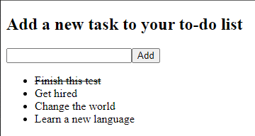

<h1 align="center">Magroove Tech Test JavaScript</h1>
<h3 align="center">To-Do List</h3>


<p align="center">
  
</p>

## 💻 Project
Simple To-Do list for the Magroove [challenge]('./readme.test.md').

## 🚀 Technologies
This project was developed with the following technologies:

- React JS (with Class Components)
- Python 3 (to run a Http Server)

## 🏃 Running
To run this project you'll need:
- Python 3.9.5
- Terminal (like Git Bash)
- No need to install React dependencies

After cloning/downloading the project, run the Http Server:
```
python -m http.server 8000
```
Then, open the app on http://localhost:8000/